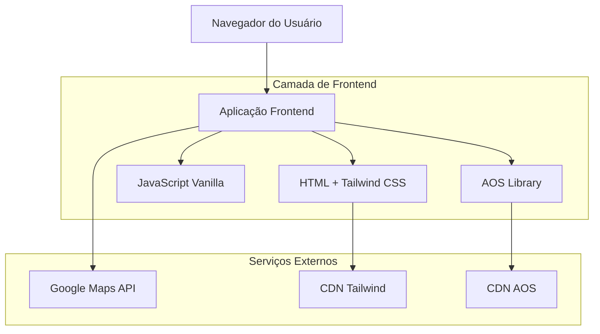

## 1. Arquitetura do Sistema



## 2. Descrição das Tecnologias

- **Frontend**: HTML5 + Tailwind CSS (via CDN) + JavaScript ES6
- **Ferramenta de Inicialização**: Nenhuma (projeto estático)
- **Backend**: Nenhum (site institucional estático)
- **Animações**: AOS (Animate On Scroll) via CDN
- **Mapas**: Google Maps JavaScript API com customização grayscale
- **Hospedagem**: Servidor estático (Netlify, Vercel ou similar)

## 3. Definições de Rotas

| Rota | Propósito |
|------|-----------|
| /index.html | Página inicial com hero section e destaques de projetos |
| /projetos.html | Galeria de projetos em grid mosaico |
| /projeto/[nome].html | Página individual de cada projeto (URLs amigáveis) |
| /escritorio.html | Sobre o escritório e timeline de premiações |
| /contato.html | Formulário de contato e mapa interativo |

## 4. Estrutura de Arquivos

```
site-arruar-arquitetura/
├── index.html
├── projetos.html
├── escritorio.html
├── contato.html
├── css/
│   └── custom.css (estilos adicionais além do Tailwind)
├── js/
│   ├── main.js (funcionalidades principais)
│   ├── projetos.js (filtros e interações)
│   └── contato.js (formulário e mapa)
├── assets/
│   ├── imagens/
│   │   ├── projetos/ (subpastas por categoria)
│   │   └── equipe/
│   └── icons/
└── data/
    └── projetos.json (dados dos projetos para JS)
```

## 5. Componentes JavaScript Principais

### 5.1 Sistema de Grid Mosaico
```javascript
// Responsável pelo layout assimétrico dos projetos
function initMosaicGrid() {
  const grid = document.querySelector('.mosaic-grid');
  const items = grid.querySelectorAll('.project-item');
  
  // Define proporções variadas para criar padrão mosaico
  const ratios = ['1x1', '16x9', '4x3', '3x4'];
  
  items.forEach((item, index) => {
    const ratio = ratios[index % ratios.length];
    item.classList.add(`ratio-${ratio}`);
  });
}
```

### 5.2 Filtros de Categoria
```javascript
// Filtra projetos por categoria sem reload da página
function setupProjectFilters() {
  const filterButtons = document.querySelectorAll('.filter-btn');
  const projects = document.querySelectorAll('.project-item');
  
  filterButtons.forEach(btn => {
    btn.addEventListener('click', () => {
      const category = btn.dataset.category;
      
      projects.forEach(project => {
        if (category === 'all' || project.dataset.category === category) {
          project.style.display = 'block';
        } else {
          project.style.display = 'none';
        }
      });
    });
  });
}
```

### 5.3 Timeline Animada
```javascript
// Controla animação da timeline de premiações
function animateTimeline() {
  const timeline = document.querySelector('.timeline');
  const items = timeline.querySelectorAll('.timeline-item');
  
  // Usa IntersectionObserver para trigger de animação
  const observer = new IntersectionObserver((entries) => {
    entries.forEach(entry => {
      if (entry.isIntersecting) {
        entry.target.classList.add('animate-in');
      }
    });
  });
  
  items.forEach(item => observer.observe(item));
}
```

### 5.4 Mapa Grayscale
```javascript
// Inicializa mapa com estilo personalizado grayscale
function initGrayscaleMap() {
  const map = new google.maps.Map(document.getElementById('map'), {
    center: {lat: -23.5505, lng: -46.6333}, // São Paulo
    zoom: 15,
    styles: [
      {
        "featureType": "all",
        "elementType": "all",
        "stylers": [{"saturation": -100}]
      }
    ]
  });
  
  // Marcador personalizado preto
  new google.maps.Marker({
    position: map.getCenter(),
    map: map,
    icon: {
      path: google.maps.SymbolPath.CIRCLE,
      scale: 8,
      fillColor: '#000000',
      fillOpacity: 1,
      strokeWeight: 0
    }
  });
}
```

## 6. Otimizações de Performance

- **Imagens**: Compressão otimizada, formato WebP com fallback JPEG, lazy loading nativo
- **CSS**: Tailwind minificado via CDN, custom.css limitado a 50 linhas
- **JavaScript**: Bundle único para cada página, código assíncrono para mapas
- **Fontes**: System fonts (Helvetica, Arial, sans-serif) para evitar carregamento externo
- **Cache**: Headers de cache configurados para assets estáticos

## 7. SEO e Acessibilidade

- **Meta tags**: Títulos únicos por página, descrições relevantes, Open Graph
- **Schema.org**: Structured data para Organization e LocalBusiness
- **Acessibilidade**: Alt text em todas imagens, navegação por teclado, contraste 4.5:1
- **Performance**: Meta tags viewport, lazy loading, imagens responsivas com srcset