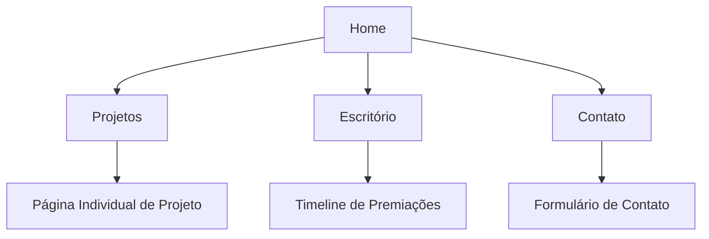

## 1. Visão Geral do Produto
Site institucional para o escritório Arruar Arquitetura, apresentando portfólio de projetos, informações sobre o escritório e formas de contato. O objetivo é transmitir a identidade minimalista e sofisticada do escritório através de um design clean e moderno.

- Público-alvo: Clientes potenciais, parceiros e visitantes interessados em serviços de arquitetura
- Valor do produto: Portfólio profissional online que reflete a identidade visual do escritório e facilita o contato com prospects

## 2. Funcionalidades Principais

### 2.1 Módulos de Funcionalidades
Nosso site institucional consiste nas seguintes páginas principais:
1. **Home**: apresentação visual do escritório, navegação principal, destaques de projetos
2. **Projetos**: galeria de projetos em grid mosaico, filtros por categoria, página individual de projeto
3. **Escritório**: história, equipe, timeline de premiações, filosofia de trabalho
4. **Contato**: formulário de contato, informações de endereço, mapa interativo em grayscale

### 2.2 Detalhamento das Páginas
| Nome da Página | Módulo | Descrição da Funcionalidade |
|----------------|---------|---------------------------|
| Home | Hero Section | Apresentação visual impactante com animação AOS, navegação minimalista preto/branco |
| Home | Grid Destaques | Exibição de projetos em grid mosaico responsivo com hover effects |
| Projetos | Galeria Mosaico | Grid assimétrico de projetos com imagens em alta resolução, filtros por categoria |
| Projetos | Página Individual | Visualização ampliada do projeto com descrição, imagens e dados técnicos |
| Escritório | Sobre | Texto institucional contando a história e filosofia do escritório |
| Escritório | Timeline Premiações | Linha do tempo vertical mostrando prêmios e reconhecimentos com animação AOS |
| Escritório | Equipe | Cards com foto e breve descrição dos profissionais |
| Contato | Formulário | Campos para nome, email, telefone, tipo de projeto e mensagem com validação |
| Contato | Mapa | Mapa interativo em tons de cinza mostrando localização do escritório |
| Contato | Informações | Endereço, telefone, email e horários de atendimento |

## 3. Fluxo Principal
O usuário navega livremente entre as páginas através do menu principal fixo. O fluxo típico começa na Home, explorando os destaques, navegando para a página de Projetos para ver o portfólio completo, conhecendo o Escritório através da timeline e informações institucionais, e finalizando no Contato para iniciar uma conversa sobre projetos.

## 4. Design de Interface

### 4.1 Estilo de Design
- **Cores primárias**: Preto (#000000) e branco (#FFFFFF)
- **Cores secundárias**: Tons de cinza (#666666, #CCCCCC) para elementos de apoio
- **Estilo de botões**: Bordas finas de 1px, hover com transição suave, sem preenchimento (outline)
- **Tipografia**: Fonte sans-serif moderna (sugestão: Helvetica Neue ou similar), títulos 32-48px, texto corporal 16-18px
- **Layout**: Grid de 12 colunas, espaçamentos generosos, linhas divisorias de 1px
- **Ícones**: Estilo outline minimalista, stroke de 1px

### 4.2 Visão Geral das Páginas
| Página | Módulo | Elementos de UI |
|--------|---------|----------------|
| Home | Hero | Imagem full-width com overlay de texto centralizado, navegação superior transparente |
| Home | Grid | Grid mosaico com proporções variadas (1:1, 16:9, 4:3), gap de 20px, hover zoom suave |
| Projetos | Galeria | Filtros horizontais com underline de 1px, grid responsivo com 2-4 colunas |
| Projetos | Individual | Carousel de imagens, descrição lateral com título em 32px, texto em 16px |
| Escritório | Timeline | Linha vertical de 1px, círculos de 8px para marcar eventos, texto alternando lados |
| Escritório | Equipe | Cards com borda de 1px, imagem circular de 120px, nome em 20px |
| Contato | Formulário | Inputs com borda inferior de 1px, labels flutuantes, botão submit minimalista |
| Contato | Mapa | Mapa em grayscale com custom styles, marcador personalizado em preto |

### 4.3 Responsividade
Desktop-first com adaptação para tablets e mobile. Breakpoints: 1200px (desktop), 768px (tablet), 320px (mobile). Menu transforma em hamburger no mobile, grids ajustam de 4 para 2 ou 1 coluna conforme tamanho.

### 4.4 Animações
Utilizar AOS (Animate On Scroll) para animações suaves durante o scroll: fade-up para elementos de entrada, fade-in para imagens, slide-in para timeline. Transições de hover com duração de 0.3s ease-in-out.